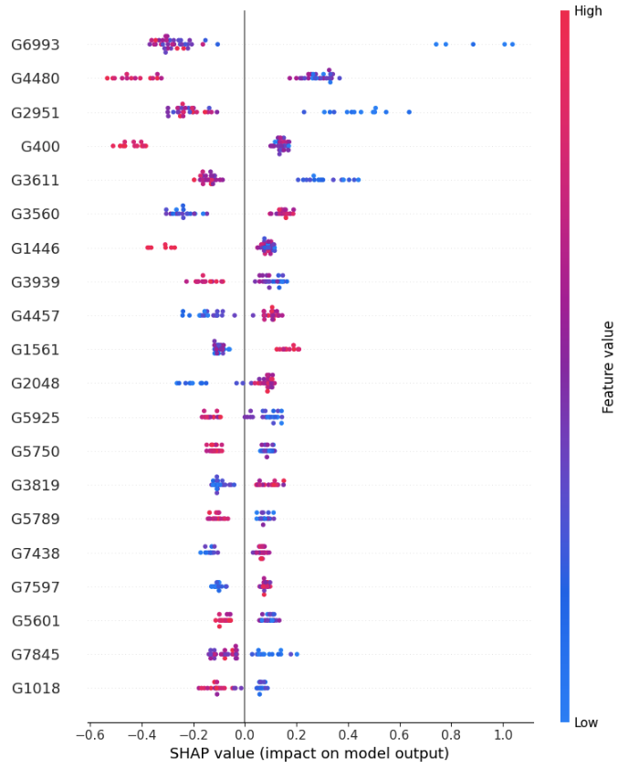

# FROG-MOMI

AI-driven target discovery pipeline using TCGA BRCA data,
combining machine learning prediction, SHAP-based explainability,
and differential expression analysis.

This project demonstrates an end-to-end workflow for identifying
biologically interpretable candidate targets using explainable AI.

**Multi-Omics + Clinical Stratification → Target Discovery → Evidence Report**

End-to-end, reproducible pipeline that connects public multi-omics data with
machine learning and explainable AI to identify patient subtypes and
biologically grounded target candidates.

---

## What this shows
- Patient/sample stratification from transcriptomics + clinical metadata
- Phenotype prediction with explainability (SHAP)
- Target / biomarker shortlist via DEG + pathway analysis
- Evidence-backed reporting (retrieval-first, LLM-ready)

This project is designed to demonstrate **how AI supports biomedical decision-making**, not just model accuracy.

---

## Pipeline Overview
1. Gene expression preprocessing (TCGA BRCA)
2. Unsupervised stratification (UMAP + Clustering)
3. XGBoost survival classification
4. SHAP-based feature attribution
5. Differential expression validation (DEG + GSEA)
6. Final target prioritization
7. Generate evidence report (Markdown)

---

## Tech stack
- Python (pandas, scikit-learn, xgboost, shap)
- UMAP, GSEA (gseapy)
- Streamlit (demo UI)
- Modular, reproducible pipeline

---

## Status
🚧 MVP in progress (single TCGA cancer type)

---

## Disclaimer
Public data only. No PHI used.

## Demo (visual overview)

> This section will show the full end-to-end workflow once the MVP is complete.

### 1. Sample stratification
UMAP embedding of samples with unsupervised clustering to reveal latent subtypes.

---

### 2. Phenotype prediction + explainability
We used SHAP to interpret the XGBoost classifier and identify
genes with the strongest contribution to survival prediction.

---

### 3. Target discovery
Differential expression and pathway enrichment identify candidate targets.
Final targets were selected by intersecting:
- High SHAP importance
- Statistically significant differential expression (p < 0.01)

| Gene | SHAP | p-value | logFC |
|------|------|--------|-------|
| G6993 | 0.35 | 3.0e-4 | -0.49 |
| G4480 | 0.33 | 8.8e-4 | -0.47 |
| G2951 | 0.29 | 7.3e-3 | -0.37 |
| G400  | 0.23 | 1.6e-3 | -0.45 |

---

### 4. Reproducibility

Processed artifacts:
- `data/processed/Xf.pkl`
- `data/processed/shap_importance.csv`
- `data/processed/candidate_genes_intersection.csv`

Model:
- `data/models/xgb_model.json`
___

### 5. Evidence report (auto-generated)
Top candidates are summarized with retrieved literature evidence in a Markdown report.

> This repository focuses on explainable AI for target discovery,
> aligning with real-world translational and clinical decision-making.

